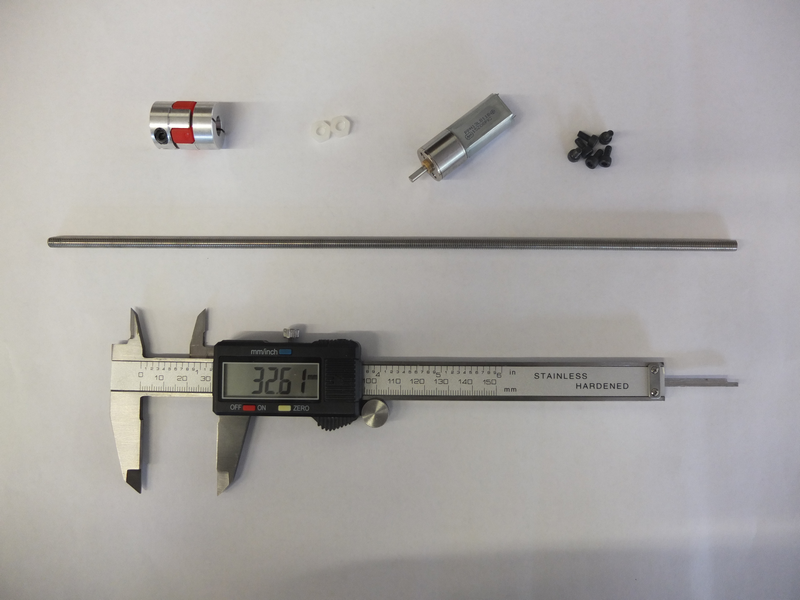

# Digital Caliper Linear Actuator

## Building a Linear Actuator From a Set of Digital Calipers

### Introduction
This is a tutorial for construction of a linear actuator with encoder feedback capable of linear positioning to a precision of 0.01mm. The system is based on a set of standard digital calipers and requires only 3D printed components and basic hardware. 

### Hardware requirements

* **1x Standard Digital Caliper**
    * These can be found on eBay, amazon or your local hardware shop for ~£15.
* **1x 12V Hobby DC Gearmotor**
    * Preferably high torque. The motor used here was 120rpm.
    * Look for a metric shaft diameter. The motor used here had a 3mm shaft.
    * These types of hobby motors can be found on eBay or at your local hobby store. [This](http://www.ebay.co.uk/itm/120RPM-12V-0-5A-High-Torque-Mini-Electric-DC-Geared-Motor/290912754915?_trksid=p2047675.c100011.m1850&_trkparms=aid%3D222007%26algo%3DSIC.MBE%26ao%3D1%26asc%3D25292%26meid%3D3328ae8d418844cdbd0718bd1c078b82%26pid%3D100011%26prg%3D10621%26rk%3D4%26rkt%3D10%26sd%3D271576830585) is the motor used here.
* **1x 5x3mm Motor Coupling**
    * This is to couple your DC Gearmotor to your M5 Threaded Rod. If you have a different shaft diameter, you will need a 5x_mm Motor Coupling.
    * This is probably the most difficult component to source, but eBay generally has a good selection. It is also possible to machine or 3D print a coupling yourself, but it will not have the same robustness as a flexible jaw coupling.
* **1x 200mm M5 Threaded Rod**
    * Look for high quality A2 or A4 stainless steel. Stiffness and precision machining are desirable. 
* **8x M3x8mm Hex Bolts**
* **2x M5 Nylon Hex Nuts**
    * Nylon hex nuts are preferable because of their low friction, but if you struggle to find them, then normal stainless steel ones will suffice

### Software requirements
* SimpleCV - see below for installation instructions

### Step 1 - Connect the camera module  
Connect the camera module to the CSI port on the Raspberry Pi. With the camera connected, enable the camera from the raspi-config menu. Detailed instructions on how to install the camera can be found at [http://www.raspberrypi.org/archives/3890](http://www.raspberrypi.org/archives/3890).

### Step 2 - Check that the camera is connected  
In the terminal, type the following command
`raspistill -t 5000`
This will display a preview window for 5 seconds.

### Step 3 - Install SimpleCV
First install the necessary dependency packages required by SimpleCV. This can be done in the terminal with the command 
`sudo apt-get install ipython python-opencv python-scipy python-numpy python-setuptools python-pip` 

Next download and install SimpleCV itself 
`sudo pip install https://github.com/sightmachine/SimpleCV/zipball/master` 
 
SimpleCV should now be installed on your Raspberry Pi. SimpleCV comes with its own shell application which can be accessed from the terminal by typing `simplecv`. From here you can carry out the full range of image processing operations available. However for more complex operations and for interfacing with the Raspberry Pi camera it is easier to use Python scripts.

### Step 4 - Loading an image from the camera into SimpleCV  
Everything is now in place to start using SimpleCV and the camera module. Open up a text editor and type the following: 
 
    import subprocess
    from SimpleCV import Image
    import time

    call(“raspistill -n -t 0 -w %s -h %s -o image.bmp” % 640 480, shell=True)

    img = Image(“image.bmp”)

    img.show()
    time.sleep(5)

Save the text file as ‘camera.py’, and in the command line type `python camera.py` to run.

The program opens up the camera, takes a still photo, and saves it to a file called image.bmp. SimpleCV then opens the file and displays it on screen for 5 seconds. Normally in SimpleCV an image can be loaded directly from the camera, for example:
 
    cam = Camera()
    img = cam.getImage()
  
However unfortunately there is no similar method for interacting with the Raspberry Pi, which is why this rather roundabout approach of calling the command-line instruction from within Python must be used.

### Step 5 - Image processing  
With the camera image now loaded into SimpleCV, we can perform any image processing tasks we need. For example, try adding one of the following code snippets to the end of the program and running: 
 
    img = img.edges()
    img.show()
    time.sleep(5)

    img = img.binarize()
    img.show()
    time.sleep(5) 

    img = img.findBlobs()
    for blob in blobs:
        blob.draw()  
    img.show()
    time.sleep(5) 

